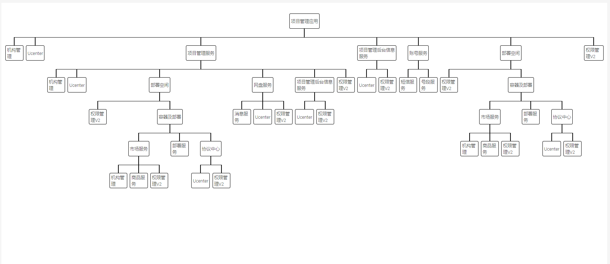

# 开发踩坑记录8月
> 基于中台idg框架开发踩坑记录，包括页面结构梳理，项目结构，组件使用，命名规范等等
## 8.5
### 1、应用-服务-子服务-包
中台应用层级关系，基于应用（第一层），服务（第二层可包含子服务），最后一层才是开发的各个包（业务代码）。  
应用可以没有包，也可以没有服务，调用别的服务。  
中台包（Packages）和npm包是不同的。  
调用链：requestStack


### 2、SessionStorage
全局存取。
### 3、递归的应用

### 4、treeSelect
>基于中台iview，select和tree组件实现。  
select-dropdownMenu  
tree-render

### 5、前端方法，产品化开发
模块化开发思维  
先写前端方法，使开发效率得到提升。  

## 8.6
### 1、JSON对象替换键名

```js
var json = [
    {
        "Id":"3972679ef2c04151972b376dd88e6413",
        "T_CourseId":"7a4494aae1804d3e94094583249750fe",
        "CourseName":"英语",
        "Code":"english"
    },
    {
        "Id":"5665d803e7994b26a56c6287d12c2090",
        "T_CourseId":"75761ad2ce23498c9f9db134ab844aec",
        "CourseName":"药物化学",
        "Code":"ywhx"
    }
]
```
怎么使用js高效的将其中的CourseName更改为title，得到结果如下：
```js
[
    {
        "Id":"3972679ef2c04151972b376dd88e6413",
        "T_CourseId":"7a4494aae1804d3e94094583249750fe",
        "title":"英语",
        "Code":"english"
    },
    {
        "Id":"5665d803e7994b26a56c6287d12c2090",
        "T_CourseId":"75761ad2ce23498c9f9db134ab844aec",
        "title":"药物化学",
        "Code":"ywhx"
    }
]
```
先将json对象转为json字符串，再替换你要替换的属性名，最后再转为json对象
```js
json=JSON.parse(JSON.stringify(json).replace(/CourseName/g,"title"));
```
 ### 2、组件要写TAG，方便调试
 ### 3、前端开发要注重用户体验
 不同分辨率下的组件尺寸
 ```ts
 <Input class='xs:w-full xl:w-1/3 md:w-1/4' />
 ```
 总条数小于10，分页隐藏
 ```ts
 {
   this.total < 10 &&
   <Page total={this.total} on-on-change={this.handlePageChange}/>
 }
 ```
 ### 4、组件内部不能直接耦合路由参数
 应当在page中拿到路由参数，再用Prop传入组件。
